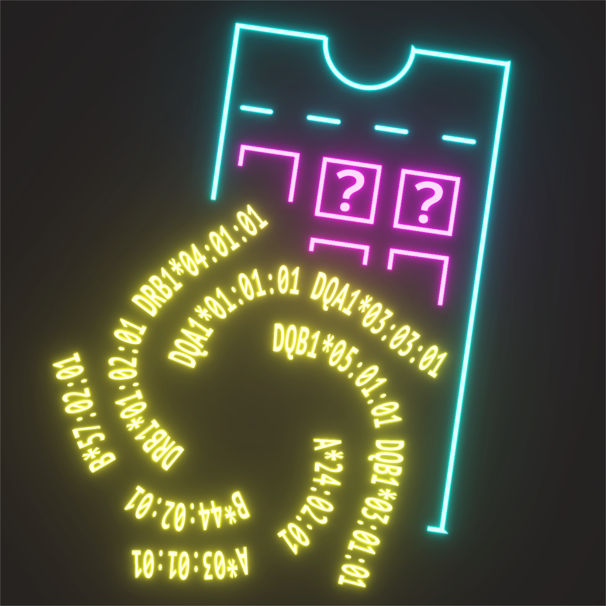

# scrHLAmatrix
Operating on [scrHLAtag](https://github.com/furlan-lab/scrHLAtag) output to predict HLA genotypes in single cells, no matter if these cells belong to one or more allogeneic entity(ies), and to filter errors/remove PCR duplicates of the identified HLA reads in single cells, before finally summarizing them into [Seurat](https://github.com/satijalab/seurat)-compatible matrices.

<p align="center"></a></p>
<hr>


## Overview
scrHLAmatrix is the accompanying R package for use with data generated using the command line tool [scrHLAtag](https://github.com/furlan-lab/scrHLAtag), which itself is used for processing long-read (PacBio) sequencing data generated from 10x Genomics libraries. In general, scrHLAmatrix uses two kinds of input:
1. The count files of the number of reads that map to the HLA sequence reference and their associated Cell-Barcodes and UMIs, for example the `molecules_info_gene.txt.gz` and `molecules_info_mRNA.txt.gz` scrHLAtag outputs. 
2. A related Seurat object where the HLA count matrices generated by scrHLAmatrix will be mapped and embedded. 

It is important to note that, first, scrHLAtag must be run on the BAM file(s) from the "corrected" (not the "dedup") step that would have been processed using the single cell [IsoSeq3 pipeline](https://github.com/PacificBiosciences/IsoSeq).

## Installation 
In your R console, write the commande:
```
remotes::install_github("https://github.com/furlan-lab/scrHLAmatrix")

## make sure leiden and its python dependencies are installed:
reticulate::install_python(version = '<version>') #example '3.8.2'
reticulate::py_install('python-igraph')
reticulate::py_install('leidenalg', forge = TRUE)
reticulate::py_config()
```

## Usage
Load HLA count files: 
```
library(scrHLAmatrix)

dirs_path <- c("path/to/scrHLAtag/out/files1", "path/to/scrHLAtag/out/files2")
dirnames <- c("samp1", "samp2") # this is how the samples were organized in the directories
cts <- HLA_load(directories = dirs_path, dir_names = dirnames, seu = your_Seurat_obj) 
```
Note: The `seu` argument is optional, but very usefull when 2 or more samples/directories are present for the same "merged" Seurat object. Try to get the names as closely as possible to the sample ID names spposedly present in the corresponding Seurat object, which is usually concatenated to Seurat barcodes when experiments are merged with the Seurat `merge()` function; something that looks like `SAMPLE1_ACTAACTCAATATAGG-1`.

Retrieve Top HLA allele candidates:
```
top_alleles <- Top_HLA_list(reads_1 = cts[["mRNA"]], reads_2 = cts[["gene"]], seu = your_Seurat_obj, suppress_plots = F)
```
Write new 'alleles' file that you can provide back to scrHLAtag:
```
write(top_alleles, file.path(dirs_path, "top_alleles.csv")))
```
That's it!.. time for another scrHLAtag iteration, and repeat for typically ~4-5 iterations, until the `Top_HLA_list()` function tells you it converged and was the final iteration

For more information on the various functions and data, as well as examples to run, look into:
```
?HLA_load
?HLA_Matrix
?Top_HLA_list
?Top_HLA_plot_bulk
?Top_HLA_plot_byCB
?HLA_clusters
?map_HLA_clusters
?freq
```
